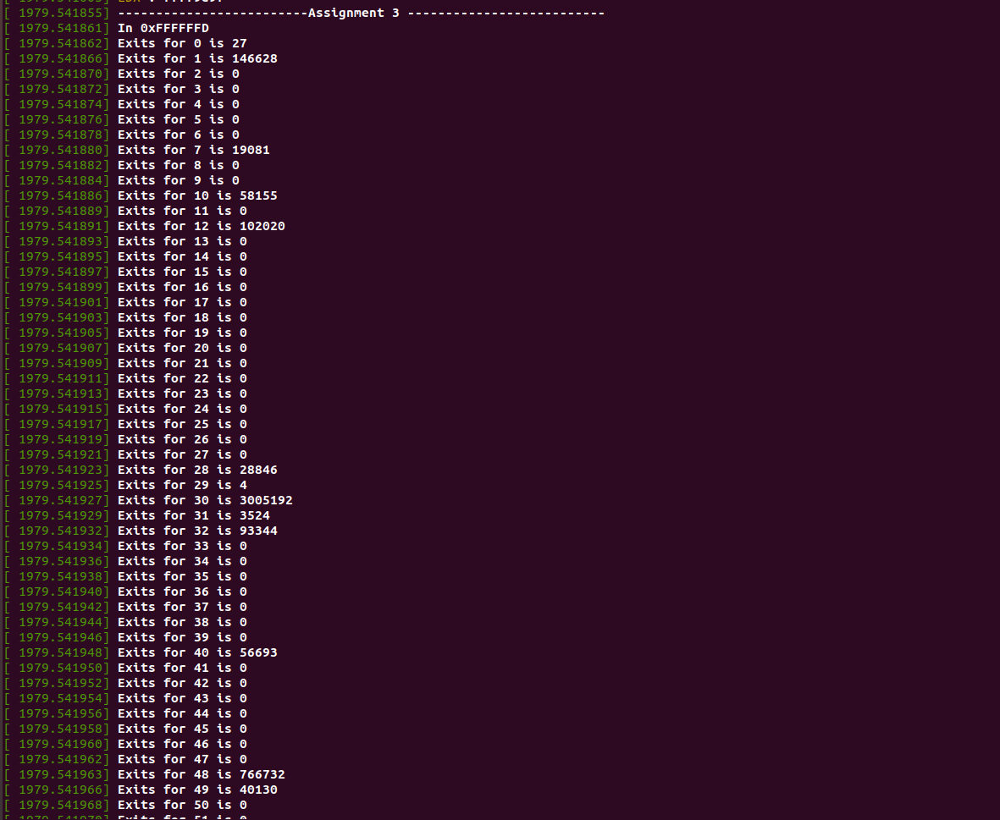
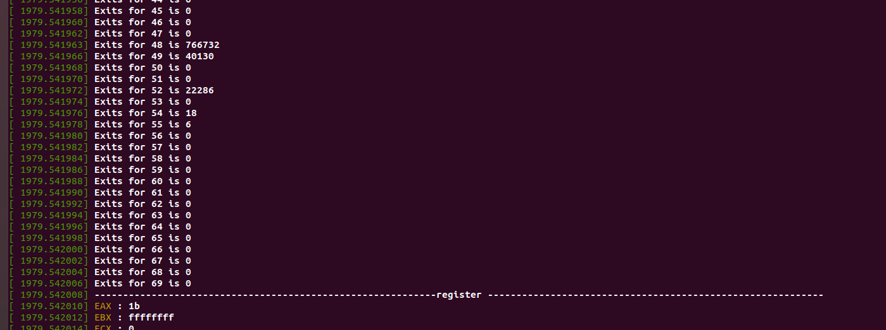
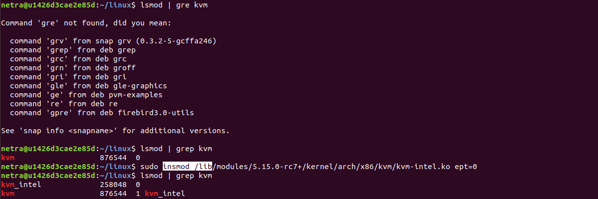
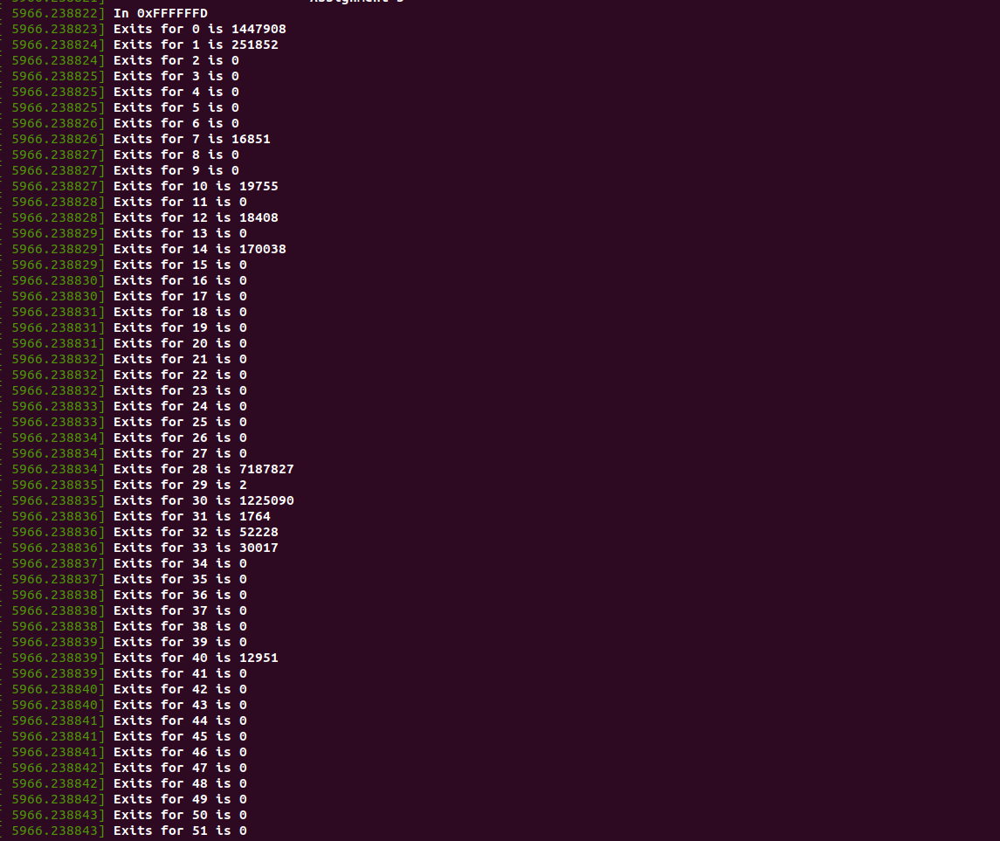
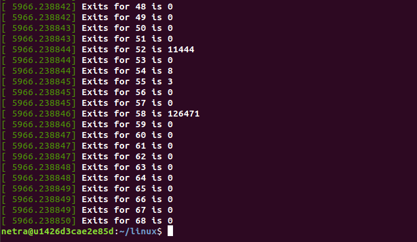

# Assignment 4: Nested Paging vs. Shadow Paging
# Question 1: Individual
# Question 2 : Output 
-  With EPT
	- 
	- 
-  Without EPT (EPT= 0)
   - Steps
	```	
        	
	```
   -
	- 
	- 
# Question 3: What did you learn from the count of exits? Was the count what you expected? If not, why not?
- The number of exits increased as expected (ept = 0).
- In Nested Paging page table walkthrough is performed twice. However, in shadow paging exit occurs frequently, and control is transfered to VMM (Virtual Machine Monitor) or Hypervisor. 
- In conclusion, Shadow paging (ept = 0) adds more overhead to VMM.

# What changed between the two runs (ept vs no-ept)   
- Number of exits changed between ept vs no-ept
- Exits increased for INVLPG (exit reason 14), VMFUNC (exit reason 58), VM-entry failure due to invalid guest state (exit reason 33).
- Exits decreased for EPT misconfiguration (exit reason 49)
