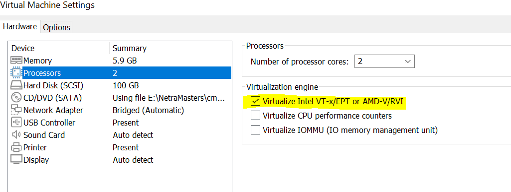
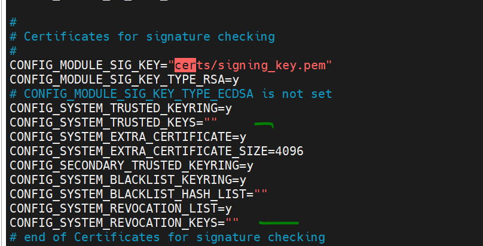

# Question 1: Individual
# Question 2 : STEPS
-  Run following command on guest VM

    - sudo apt-get update
    - sudo apt-get -y install openssh-server git build-essential kernel-package fakeroot libncurses5-dev libssl-dev ccache libelf-dev bison flex
    - git clone https://github.com/neetra/linux.git
    - cd linux/

    - 
        ```cp /boot/config-`uname -r` .config```
    
    - make oldconfig
    - make prepare
    - make -j 2 modules
    - make -j 2
    - sudo make INSTALL_MOD_STRIP=1 modules_install
    - sudo make install
    - cd cmpe283_1/
    - make
    - sudo insmod cmpe283-1.ko
    - dmesg
    - sudo rmmod cmpe283-1
    - dmesg

# TROUBLESHOOTING
- Enable nested virtualization
    || |
    |-|-|
    |Host Machine | Windows 10 home|
    |Hypervisor|  VmWare Worker 16 Player |
    |Guest Machine| Ubuntu|
    - Open cmd as administrator and run following command
    ```
        bcdedit /set hypervisorlaunchtype off

    ```
    - Enable virtualization in  guest VM. 
        - Right Click on VM, Click settings
        - 

-   No rule to make target 'debian/certs/debian-uefi-certs.pem'     
    - Required only if error occurred - [Reference](https://stackoverflow.com/questions/67670169/compiling-kernel-gives-error-no-rule-to-make-target-debian-certs-debian-uefi-ce)
    - Edit .config file and set empty string for keys
        
    - make clean
    - sudo reboot
    - make oldconfig        


     